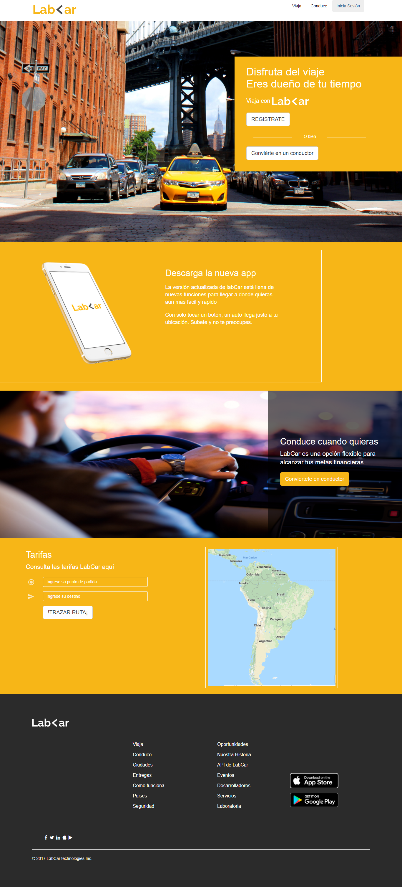

# Reto de Codigo
# LAB-<AR

## Introducción
El siguiente reto consistio en realizar una replica de la pagina web responsive LAB-<AR.  

## Contenido
Para realizar la pagina se hizo uso de los conocimientos adquiridos en clase sobre HTML, CSS y el framework Bootstrap.  
Tambien se hizo uso de modals para mostrar los formularios de inicio de sesión, registrate y conviertete en un conductor.

